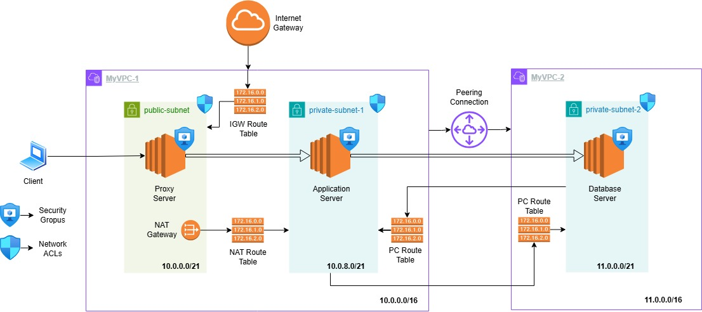

# Private App-to-DB Connectivity Across Two VPCs (NAT + VPC Peering)

This project demonstrates how to build private connectivity between an application server and a database server deployed in two different VPCs in AWS. It uses a public/private subnet design, an Internet Gateway (IGW) and NAT Gateway for outbound access from private subnets, and VPC peering + routing updates to enable cross-VPC private communication.

## Goal

- Create VPC-1 with a public subnet (proxy/bastion) and a private subnet (application).
- Provide outbound internet access for the private subnet using a NAT Gateway in the public subnet.
- Create VPC-2 with a private subnet (database).
- Establish VPC peering between VPC-1 and VPC-2 and configure routes so the application server can reach the database server using private IPs.

## Architecture (high level)

**VPC-1: MyVPC-1 (10.0.0.0/16)**
- `public-subnet` (10.0.0.0/21): Proxy Server EC2 + NAT Gateway + IGW route.
- `private-subnet` (10.0.8.0/21): Application Server EC2 (no public IP).

**VPC-2: MyVPC-2 (11.0.0.0/16)**
- `private-subnet-2` (11.0.0.0/21): Database Server EC2 (no public IP).

**Connectivity**
- IGW attached to VPC-1 enables public subnet internet access.
- NAT Gateway in VPC-1 public subnet enables outbound internet for instances in VPC-1 private subnet.
- VPC peering connects VPC-1 and VPC-2 for private routing between 10.0.0.0/16 and 11.0.0.0/16.

## Prerequisites

- AWS account access to VPC and EC2 services.
- Region: Asia Pacific (Mumbai) `ap-south-1`.
- An EC2 key pair available (example used: `sample-2-ind.pem`).

## Implementation steps (console)

### 1) Create VPC-1 (MyVPC-1)

- Create VPC: `MyVPC-1`
- IPv4 CIDR: `10.0.0.0/16`

### 2) Create subnets in VPC-1

Create two subnets inside MyVPC-1:
- Public subnet: `public-subnet` → `10.0.0.0/21`
- Private subnet: `private-subnet` → `10.0.8.0/21`

Enable auto-assign public IPv4 on `public-subnet`.

### 3) Create and attach Internet Gateway

- Create IGW: `my-igw`
- Attach `my-igw` to `MyVPC-1`.

### 4) Configure public route table

In the main/public route table for VPC-1:
- Add route `0.0.0.0/0` → `my-igw`.
- Associate this route table with `public-subnet`.

### 5) Launch Proxy Server (public subnet)

Launch an EC2 instance named **Proxy Server** in:
- VPC: `MyVPC-1`
- Subnet: `public-subnet`
- Auto-assign public IP: enabled

This instance is used to SSH into the private Application Server.

### 6) Create NAT Gateway (public subnet)

Create a NAT Gateway named `my-nat` in `public-subnet`:
- Connectivity: Public
- Allocate an Elastic IP and attach it to the NAT Gateway.

### 7) Launch Application Server (private subnet)

Launch an EC2 instance named **Application Server** in
- VPC: `MyVPC-1`
- Subnet: `private-subnet`
- Auto-assign public IP: disabled

Example private IP shown in the project: `10.0.14.230`.

### 8) Create private route table for NAT (nat-rt)

Create a route table named `nat-rt` in `MyVPC-1`.

- Associate `nat-rt` with `private-subnet`.
- Add route `0.0.0.0/0` → NAT Gateway (`my-nat`).

This gives outbound internet access to the private subnet without exposing instances publicly.

### 9) Validate outbound connectivity from private subnet

From local machine:
- Copy the key to the Proxy Server (example uses `scp`).
- SSH into Proxy Server, then SSH from Proxy to the private IP of Application Server.

From Application Server, validate outbound connectivity (example shown using `ping 8.8.8.8`).

### 10) Create VPC-2 (MyVPC-2) and subnet

Create VPC: `MyVPC-2` with:
- IPv4 CIDR: `11.0.0.0/16`

Create subnet: [file:44]
- `private-subnet-2` → `11.0.0.0/21`

### 11) Launch Database Server (private subnet in VPC-2)

Launch an EC2 instance named **Database Server** in:
- VPC: `MyVPC-2`
- Subnet: `private-subnet-2`
- Auto-assign public IP: disabled

Example private IP shown: `11.0.1.238`.

### 12) Create and accept VPC peering

Create a VPC peering connection named `my-pc`:
- Requester: `MyVPC-1`
- Accepter: `MyVPC-2`

Accept the peering request so it becomes active.

### 13) Add peering routes on both sides

To enable private routing:
- In VPC-1 route tables that serve the Application Server subnet:
  - Add route `11.0.0.0/16` → `pcx-...` (the peering connection).
- In VPC-2 route table for `private-subnet-2`:
  - Add route `10.0.0.0/16` → `pcx-...`.

After this, the Application Server in VPC-1 can reach the Database Server in VPC-2 using private IP connectivity.

## Testing (end-to-end)

- SSH: Local → Proxy Server (public) → Application Server (private).
- From Application Server, test network connectivity to Database Server private IP (`11.0.1.238`) using the required DB port or network test tools.

## Security notes (what to improve in production)

- Restrict SSH (22) to your IP instead of `0.0.0.0/0`.
- Prefer a dedicated bastion security group and separate ALLOW rules between App and DB using security group references (where applicable).
- Consider AWS Systems Manager Session Manager to avoid opening SSH to the internet.

## Repo files

- `configs/cidr-plan.md`: CIDR blocks and subnet planning used in the build.
- `configs/route-tables.md`: Route table entries for IGW, NAT, and VPC peering.
- `configs/security-groups.md`: Inbound/outbound rules used for Proxy/App/DB instances.
